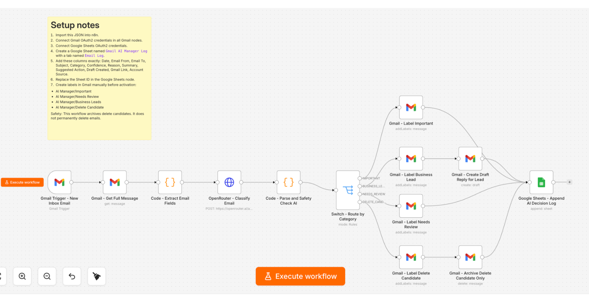

# Personal Gmail AI Manager with n8n, OpenRouter, and Google Sheets

A reusable local-first AI automation workflow that triages Gmail inbox messages, classifies them with an LLM through OpenRouter, applies Gmail labels, drafts replies for business leads, and logs every decision to Google Sheets.

This project was originally built as a personalized workflow for a real business inbox. I converted it into a generic template so other users can adapt the categories, safety rules, labels, prompts, and business context for their own inbox.

## Why I built this

Many people do not need an expensive SaaS subscription to start using AI in real workflows. They need a practical, low-cost system that runs locally, connects to tools they already use, and keeps them in control.

This project demonstrates how to build a cost-effective AI inbox assistant using:

- **n8n on localhost** as the automation engine
- **Gmail** as the inbox source
- **OpenRouter** as the LLM layer, with the option to use free or low-cost models
- **Google Sheets** as a simple decision log and audit trail
- **Human review** for draft replies and delete candidates

## Screenshot

The workflow below is the original n8n canvas view.



> The screenshot is shown as-is to document the workflow structure. Users should replace credentials, labels, prompts, and spreadsheet settings with their own configuration.

## What this project demonstrates

- Local n8n workflow design
- Gmail automation with n8n
- LLM-based email classification through OpenRouter
- Structured JSON output from an AI model
- Safety checks before labeling low-value emails
- Automatic Gmail label routing
- Draft reply generation for business leads
- Google Sheets logging for auditability
- Turning a personalized automation into a reusable portfolio project

## Workflow overview

```text
New Gmail email
   ↓
Get full message
   ↓
Extract subject, sender, recipient, body, thread ID, Gmail link
   ↓
Send email content to OpenRouter LLM
   ↓
Parse structured JSON response
   ↓
Run safety override checks
   ↓
Route by category
   ↓
Apply Gmail label / create draft reply / log to Google Sheets
```

## Default categories

| Category | Purpose |
|---|---|
| `IMPORTANT` | Personal, legal, finance, job, government, invoice, banking, medical, academic, or anything requiring attention |
| `BUSINESS_LEAD` | Collaboration, client, supplier, sales, partnership, restaurant, event, sponsorship, or commercial opportunity |
| `NEEDS_REVIEW` | Unclear messages, uncertain classification, or newsletters that may contain useful information |
| `DELETE_CANDIDATE` | Obvious spam, expired promotions, irrelevant marketing, automated noise, or low-value newsletters |

## Local-first setup

This project is intended for **n8n running locally**, not n8n Cloud.

That means you can run the automation on your own computer and avoid paying for an automation SaaS while learning and testing.

Typical local setup:

```bash
npm install n8n -g
n8n start
```

Then open:

```text
http://localhost:5678
```

You can also run n8n with Docker if you prefer a more stable local setup.

## Cost-effective usage

The workflow itself can be run locally for free. The main possible costs are external services:

- Gmail API/OAuth: normally free for personal use
- Google Sheets: normally free for personal use
- n8n localhost: free to run locally
- OpenRouter: depends on the model you choose

For a low-cost learning setup, choose a free or very cheap OpenRouter model first. Later, replace the model with a stronger one only if the classification quality is not good enough.

## Optional: use Claude Code with n8n MCP

For users who want to modify the workflow faster, this project can also be used together with Claude Code and an n8n MCP server.

A practical workflow is:

1. Run n8n locally.
2. Enable or configure access to your local n8n API.
3. Add an n8n MCP server to Claude Code.
4. Ask Claude Code to inspect, improve, or generate n8n workflow JSON.
5. Import the updated JSON into local n8n and test it manually.

Example MCP configuration pattern:

```json
{
  "mcpServers": {
    "n8n-local": {
      "command": "npx",
      "args": ["-y", "n8n-mcp"],
      "env": {
        "N8N_API_URL": "http://localhost:5678/api/v1",
        "N8N_API_KEY": "YOUR_LOCAL_N8N_API_KEY"
      }
    }
  }
}
```

This configuration is intentionally shown as a pattern, because MCP server package names and setup commands may differ depending on the n8n MCP server you choose. Always check the README of the MCP server package before adding API keys.

## Safety principles

This workflow is designed to assist inbox triage, not to replace human judgment.

Important safety choices:

- It creates draft replies; it does not send replies automatically.
- It labels delete candidates; it should not permanently delete emails.
- It includes a safety override for sensitive words.
- It logs every AI decision to Google Sheets.
- When uncertain, it routes emails to `NEEDS_REVIEW`.

## Repository structure

```text
.
├── README.md
├── workflows/
│   └── gmail_ai_manager_template.json
├── docs/
│   ├── customization-guide.md
│   └── github-showcase-post.md
├── assets/
│   └── workflow-screenshot.svg
└── .gitignore
```

## Setup

1. Import `workflows/gmail_ai_manager_template.json` into n8n.
2. Connect Gmail OAuth2 credentials in every Gmail node.
3. Connect Google Sheets OAuth2 credentials.
4. Create a Google Sheet named `Gmail AI Manager Log`.
5. Create a tab named `Email Log`.
6. Add these columns exactly:

```text
Date, Email From, Email To, Subject, Category, Confidence, Reason, Summary, Suggested Action, Draft Created, Gmail Link, Account Source
```

7. Replace the placeholder Sheet ID in the Google Sheets node.
8. Create Gmail labels manually before activation:

```text
AI Manager/Important
AI Manager/Needs Review
AI Manager/Business Leads
AI Manager/Delete Candidate
```

9. Add your OpenRouter credentials.
10. Test with manual execution before activating the trigger.

## Customization ideas

You can adapt this workflow for:

- Freelance client lead management
- Job search email triage
- Founder/startup inbox management
- Research collaboration emails
- Course/newsletter filtering
- Customer support intake
- Supplier and manufacturer outreach
- Event and partnership workflows

## What to change before using it

Open the `OpenRouter - Classify Email` node and customize:

- The AI role
- Your categories
- Your safety keywords
- Your draft reply style
- Your business or personal context
- The model name

Open the Gmail label nodes and update:

- Label IDs
- Label names
- Archive/delete behavior

Open the Google Sheets node and update:

- Spreadsheet URL or ID
- Sheet name
- Column mapping

## Disclaimer

This is a learning and portfolio project. Review all actions before using it on an important inbox. Do not use it to automatically delete, send, or archive important emails until you have tested the workflow carefully.
